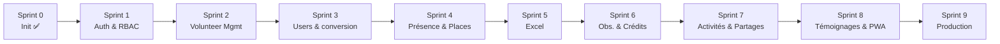

# Roadmap — Gestion Bénévole (Maison du Numérique)

> Source unique de la vue d'ensemble. **Remplace l'ancien dossier `todos/`**, migré ici le 2026-10-01.
> Détail d'un sprint : `tasks/NN_sprintN_*.md` · Cadre fonctionnel : `prd.md` · Technique : `archi.md` · Rappel historique : `references/CDC_PWA_Gestion_Benevoles.md`

## 📌 Équipe & Collaborateurs GitHub

| #               | Compte GitHub            | Rôle                                    |
| --------------- | ------------------------ | --------------------------------------- |
| Lead            | `@tahiry-dev-29`         | Lead                                    |
| Collaborateur 1 | `@flavienrandria81`      | Backend 1 ou Frontend 1                 |
| Collaborateur 2 | `@HunjanRakotoarison`    | Backend 2 ou Frontend 2                 |
| Collaborateur 3 | `@rasoarimanana71-maker` | Frontend 1 ou 2                         |

## 🗓️ Roadmap des sprints

| Sprint | Périmètre | Durée | Statut | Backlog |
| ------ | --------- | ----- | ------ | ------- |
| 0 | Initialisation & Setup | 1 semaine | ✅ Terminé | [`tasks/00_sprint0_init.md`](./tasks/00_sprint0_init.md) |
| 1 | **Auth & RBAC** — app fermée, 4 rôles, `/login` unique | 2 semaines | ⚪ À venir | [`tasks/01_sprint1_auth_rbac.md`](./tasks/01_sprint1_auth_rbac.md) |
| 2 | **Volunteer Management** — sous-liste, roles management, CRUD sécurisé | 2 semaines | ⚪ À venir | [`tasks/02_sprint2_volunteer_management.md`](./tasks/02_sprint2_volunteer_management.md) |
| 3 | **Users & conversion** — propriétés USER, certificat → VOLUNTEER | 2 semaines | ⚪ À venir | [`tasks/03_sprint3_users_conversion.md`](./tasks/03_sprint3_users_conversion.md) |
| 4 | **Présence & Places** — CRUD tables/sièges, pointage avec place | 2 semaines | ⚪ À venir | [`tasks/04_sprint4_presence_places.md`](./tasks/04_sprint4_presence_places.md) |
| 5 | **Import / Export Excel** (users + présences) | 1 semaine | ⚪ À venir | [`tasks/05_sprint5_excel_import_export.md`](./tasks/05_sprint5_excel_import_export.md) |
| 6 | Observations mensuelles & Liste Crédit | 2 semaines | ⚪ À venir | [`tasks/06_sprint6_obs_credit.md`](./tasks/06_sprint6_obs_credit.md) |
| 7 | Public : Activité & Partage | 2 semaines | ⚪ À venir | [`tasks/07_sprint7_activite_partage.md`](./tasks/07_sprint7_activite_partage.md) |
| 8 | Public : Témoignage & Finalisation PWA | 2 semaines | ⚪ À venir | [`tasks/08_sprint8_temoignage_pwa.md`](./tasks/08_sprint8_temoignage_pwa.md) |
| 9 | Mise en production | 1 semaine | ⚪ À venir | [`tasks/09_sprint9_production.md`](./tasks/09_sprint9_production.md) |

> Sprints 6 à 9 issus de l'ancienne roadmap `todos/` (anciens sprints 4 à 7), renumérotés et alignés sur le vocabulaire `VOLUNTEER`.

## 📋 Périmètre global (modules → sprints)

| Module | Détail | Sprints |
| ------ | ------ | ------- |
| Auth fermée | `/` → `/login`, pas de `/sign-up`, `USER` non connectable | 1 |
| RBAC 4 rôles | `SUPER_ADMIN` / `ADMIN` / `VOLUNTEER` / `USER` + matrice `canCreate` | 1 |
| Volunteer management | liste + add + roles + fiche, CRUD sécurisé | 2 |
| Gestion USER | propriétés complètes, `/admin/users/*`, conversion par certificat | 3 |
| Présence & places | CRUD tables/sièges, pointage table+siège, calendrier | 4 |
| Excel | import/export des listes USER et présences | 5 |
| Observation (admin) | note mensuelle par bénévole | 6 |
| Crédit (admin) | cumul heures/crédits, totaux | 6 |
| Activité / Partage (public) | liste + détail, publication admin | 7 |
| Témoignage (public) | soumission + modération | 8 |
| PWA | manifest, offline, installabilité, Lighthouse | 8 |
| Prod | DB, déploiement, domaine, passation | 9 |

## 🗺️ Pipeline des sprints

## 📏 Règles de suivi (Scrum allégé)

| Règle | Détail |
| ----- | ------ |
| Statut d'une tâche | `Status: TODO` → `Status: DONE` en 1re ligne du fichier `tasks/NN_*.md` |
| Case cochée | `- [ ]` → `- [x]` **avec commit/PR associé** |
| Responsable | Colonne **Dev** de chaque story : Lead / Back1 / Back2 / Front1 / Front2 |
| Clôture d'un sprint | Le **Lead** valide en revue de code avant de passer au suivant |
| Rituels | Kick-off, stand-up 2×/sem., démo + rétro en fin de sprint |
| Boucle de correction | Max 2 itérations, puis escalade au Lead |
