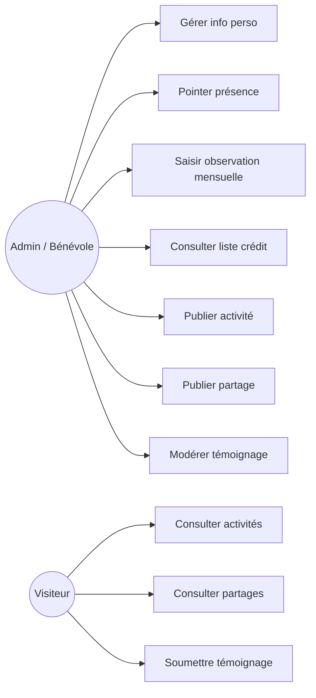
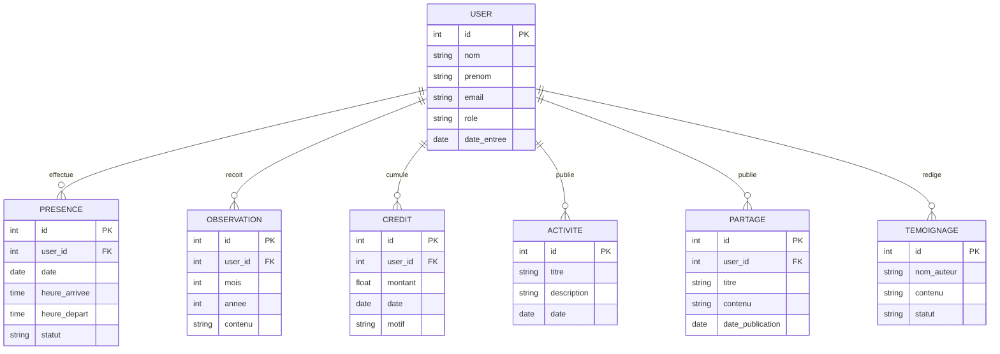
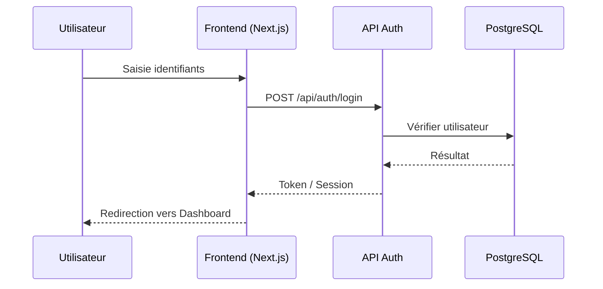

# Cahier des Charges

## Application PWA – Gestion des Bénévoles (Maison du Numérique)

---

## 1. Présentation du projet

**Nom du projet :** Gestion Bénévole – Maison du Numérique
**Type :** Progressive Web App (PWA) — installable, responsive, utilisable hors-ligne partiellement
**Objectif :** Centraliser la gestion des bénévoles (présence, suivi, crédits) et offrir une vitrine publique de leurs activités, partages et témoignages.

### Stack technique

| Composant            | Technologie                                                        |
| -------------------- | ------------------------------------------------------------------ |
| Frontend / Framework | Next.js (App Router)                                               |
| Style                | Tailwind CSS                                                       |
| Base de données      | PostgreSQL                                                         |
| ORM (recommandé)     | Prisma                                                             |
| Auth                 | NextAuth.js (ou JWT custom)                                        |
| PWA                  | next-pwa / manifest.json + service worker                          |
| Hébergement          | Géré par le Lead                                                   |
| Suivi de projet      | **Intégré dans ce document** (voir section 6) — aucune app externe |

### Équipe (5 personnes)

| Rôle               | Responsabilité                                                                                   |
| ------------------ | ------------------------------------------------------------------------------------------------ |
| **Lead (toi)**     | Initialisation du repo, config Next.js/Tailwind, architecture, hébergement, CI/CD, revue de code |
| **Dev Backend 1**  | Modélisation PostgreSQL, API routes, auth                                                        |
| **Dev Backend 2**  | API routes (présence, crédits), sécurité                                                         |
| **Dev Frontend 1** | Interfaces Admin (bénévole, présence)                                                            |
| **Dev Frontend 2** | Interfaces Public + PWA (manifest, offline)                                                      |

---

## 2. Fonctionnalités

### 2.1 Espace Admin (Bénévole)

- **Info perso** : fiche bénévole (nom, contact, rôle, photo, date d'entrée)
- **Présence**
  - Journalier : pointage quotidien (arrivée/départ)
  - Observation ?/Mois : note ou observation mensuelle par bénévole
  - Liste Crédit : suivi des crédits/heures accumulés par bénévole

### 2.2 Espace Public

- **Activité (bénévole)** : liste/actualité des activités menées
- **Partage** : publications/contenus partagés par la structure ou les bénévoles
- **Témoignage** : témoignages de bénévoles ou bénéficiaires

---

## 3. Diagrammes UML

### 3.1 Diagramme de cas d'utilisation



### 3.2 Diagramme de classes / Modèle de données (ERD)



### 3.3 Diagramme de séquence — Authentification



_(Ces diagrammes se rendent automatiquement dans GitHub, GitLab, Notion, VS Code avec l'extension Mermaid, etc.)_

---

## 4. Suivi des tâches — sans application externe

Chaque tâche ci-dessous est une **checklist Markdown standard** :

```
- [ ] Tâche à faire
- [x] Tâche terminée
```

Le bénévole/dev met un `x` entre les crochets directement dans ce fichier (édité dans le repo Git, poussé sur une branche, ou modifié en direct si le fichier est partagé). **Aucun outil tiers requis** — le fichier EST le tableau de bord, versionné avec le code.

> 💡 **Encore mieux, si tu veux aller plus loin :** comme le projet est déjà en Next.js + PostgreSQL, on peut ajouter une toute petite page interne `/admin/sprints` (une table `tasks` en base + une UI avec cases à cocher) qui remplace ce fichier par un vrai tableau de suivi persistant, développé avec la même stack — donc **zéro outil externe, zéro nouvelle techno à apprendre**. Je peux ajouter ça comme tâche du Sprint 0 si tu veux (voir case à cocher dédiée plus bas).

---

## 5. Sprints & Tâches (par équipe)

### Sprint 0 — Initialisation & Setup (1 semaine)

**Lead**

- [ ] Créer le repo Git + structure de branches (main/dev/feature)
- [ ] Initialiser projet Next.js (App Router)
- [ ] Configurer Tailwind CSS
- [ ] Configurer PostgreSQL + Prisma (schéma de base)
- [ ] Configurer variables d'environnement (.env)
- [ ] Mettre en place l'hébergement (Vercel/VPS + DB managée)
- [ ] Configurer CI/CD basique (build/lint)
- [ ] Ajouter manifest.json + icônes PWA de base
- [ ] (Optionnel) Créer table `tasks` + page `/admin/sprints` pour suivi interne

---

### Sprint 1 — Authentification & Fondations (2 semaines)

**Dev Backend 1**

- [ ] Finaliser schéma PostgreSQL (User, Presence, Observation, Credit, Activite, Partage, Temoignage)
- [ ] Créer migrations Prisma
- [ ] API Auth (login/register/logout)

**Dev Backend 2**

- [ ] Middleware de protection des routes Admin
- [ ] Gestion des rôles (admin/bénévole)

**Dev Frontend 1**

- [ ] Page de connexion (UI)
- [ ] Layout Admin (sidebar/navbar)

**Dev Frontend 2**

- [ ] Layout Public (header/footer)
- [ ] Configuration du service worker (offline shell de base)

---

### Sprint 2 — Admin : Info perso & Présence Journalière (2 semaines)

**Dev Backend 1**

- [ ] API CRUD "Info perso" bénévole
- [ ] Upload photo de profil

**Dev Backend 2**

- [ ] API Présence journalière (pointage)

**Dev Frontend 1**

- [ ] UI Fiche "Info perso" (création/édition)
- [ ] UI Présence journalière (pointage + historique)
- [ ] Liste des bénévoles (vue admin)

**Toute l'équipe**

- [ ] Tests fonctionnels Sprint 2

---

### Sprint 3 — Admin : Observation Mensuelle & Liste Crédit (2 semaines)

**Dev Backend 1**

- [ ] API Liste Crédit (ajout/consultation/calcul cumulé)

**Dev Backend 2**

- [ ] API Observation mensuelle (CRUD)
- [ ] Export simple (PDF/CSV) des crédits (optionnel)

**Dev Frontend 1**

- [ ] UI Observation par mois (formulaire + historique)
- [ ] UI Liste Crédit (tableau + total par bénévole)

**Toute l'équipe**

- [ ] Tests fonctionnels Sprint 3

---

### Sprint 4 — Public : Activité & Partage (2 semaines)

**Dev Backend 1**

- [ ] API Partage (CRUD, publication)

**Dev Backend 2**

- [ ] API Activité (CRUD, publication)

**Dev Frontend 1**

- [ ] Interface admin pour publier/modérer Activités & Partages

**Dev Frontend 2**

- [ ] UI Page publique "Activités" (liste + détail)
- [ ] UI Page publique "Partage" (liste + détail)
- [ ] Optimisation images (next/image)

---

### Sprint 5 — Public : Témoignage & Finalisation PWA (2 semaines)

**Dev Backend 2**

- [ ] API Témoignage (soumission + modération)

**Dev Frontend 2**

- [ ] UI Page publique "Témoignages"
- [ ] Formulaire de soumission de témoignage (public)
- [ ] Finaliser PWA : installabilité, icônes, splash screen
- [ ] Mode offline (cache des pages publiques)

**Lead**

- [ ] Audit Lighthouse (perf, accessibilité, PWA)

**Toute l'équipe**

- [ ] Tests globaux + corrections de bugs

---

### Sprint 6 — Mise en production (1 semaine)

**Lead**

- [ ] Configuration environnement de production
- [ ] Migration base de données production
- [ ] Déploiement final + nom de domaine

**Toute l'équipe**

- [ ] Vérification finale (checklist PWA + sécurité)

**Lead**

- [ ] Formation/passation aux utilisateurs finaux

---

## 6. Règles de suivi

- Chaque membre coche ses propres tâches (`- [ ]` → `- [x]`) directement dans ce fichier, dans son commit
- Une tâche cochée doit correspondre à un commit/PR associé
- Le **Lead** relit et valide en revue de code avant de considérer un sprint clos
- Stand-up court recommandé 2x/semaine pour passer en revue les cases cochées

---

## 7. Prochaines étapes

1. Valider ce CDC avec l'équipe
2. Décider si on ajoute la page interne `/admin/sprints` (Sprint 0) ou si le suivi reste dans ce fichier
3. Lancer le Sprint 0
