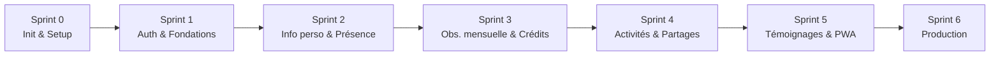

# 🗂️ Scrum Boards — Gestion Bénévole (Maison du Numérique)

> Le suivi du projet est **versionné dans le repo** (principe CDC §6) : **un dossier = un sprint**, chaque sprint contient son **TODO Scrum** (backlog, stories, tâches cochables, DoD, rétro).
> Aucun outil externe requis : le fichier **EST** le tableau de bord.

## 🧭 Documents de référence

| Document                       | Fichier                                                          | Rôle                                 |
| ------------------------------ | ---------------------------------------------------------------- | ------------------------------------ |
| Cahier des charges (CDC + UML) | [`CDC_PWA_Gestion_Benevoles.md`](./CDC_PWA_Gestion_Benevoles.md) | Référence fonctionnelle et technique |
| Roadmap + équipe               | [`sprints/ROADMAP.md`](./sprints/ROADMAP.md)                     | Vue d'ensemble des 7 sprints         |

## 📊 Tableau de bord des sprints

| Sprint                            | Backlog Scrum                                                                                                                                            | Durée  | Statut      |
| --------------------------------- | -------------------------------------------------------------------------------------------------------------------------------------------------------- | ------ | ----------- |
| 0 — Init & Setup                  | [`sprints/sprint-0/sprint-0-initialisation-et-setup.md`](./sprints/sprint-0/sprint-0-initialisation-et-setup.md)                                         | 1 sem. | 🔵 En cours |
| 1 — Auth & Fondations             | [`sprints/sprint-1/sprint-1-authentification-et-fondations.md`](./sprints/sprint-1/sprint-1-authentification-et-fondations.md)                           | 2 sem. | ⚪ À venir  |
| 2 — Info perso & Présence         | [`sprints/sprint-2/sprint-2-admin-info-perso-et-presence-journaliere.md`](./sprints/sprint-2/sprint-2-admin-info-perso-et-presence-journaliere.md)       | 2 sem. | ⚪ À venir  |
| 3 — Obs. mensuelle & Crédits      | [`sprints/sprint-3/sprint-3-admin-observation-mensuelle-et-liste-credit.md`](./sprints/sprint-3/sprint-3-admin-observation-mensuelle-et-liste-credit.md) | 2 sem. | ⚪ À venir  |
| 4 — Public : Activités & Partages | [`sprints/sprint-4/sprint-4-public-activite-et-partage.md`](./sprints/sprint-4/sprint-4-public-activite-et-partage.md)                                   | 2 sem. | ⚪ À venir  |
| 5 — Public : Témoignages + PWA    | [`sprints/sprint-5/sprint-5-public-temoignage-et-finalisation-pwa.md`](./sprints/sprint-5/sprint-5-public-temoignage-et-finalisation-pwa.md)             | 2 sem. | ⚪ À venir  |
| 6 — Mise en production            | [`sprints/sprint-6/sprint-6-mise-en-production.md`](./sprints/sprint-6/sprint-6-mise-en-production.md)                                                   | 1 sem. | ⚪ À venir  |

## 🗺️ Pipeline des sprints

## 📏 Règles de suivi (Scrum allégé)

| Règle                | Détail                                                                       |
| -------------------- | ---------------------------------------------------------------------------- |
| Cocher une tâche     | `- [ ]` → `- [x]` dans le fichier TODO du sprint, **avec commit/PR associé** |
| Responsable          | Colonne **Dev** de chaque story : Lead / Back1 / Back2 / Front1 / Front2     |
| Clôture d'un sprint  | Le **Lead** valide en revue de code avant de passer au sprint suivant        |
| Rituels              | Kick-off, stand-up 2×/sem., démo + rétro en fin de sprint                    |
| Boucle de correction | Max 2 itérations, puis escalade au Lead                                      |

## 🧑💻 Équipe (rôles CDC §1)

| Rôle               | Missions                                                                    |
| ------------------ | --------------------------------------------------------------------------- |
| **Lead**           | Repo, architecture, CI/CD, hébergement, revue de code, validation de sprint |
| **Dev Backend 1**  | Modélisation PostgreSQL, API routes, auth                                   |
| **Dev Backend 2**  | API routes (présence, crédits), sécurité                                    |
| **Dev Frontend 1** | Interfaces Admin (bénévole, présence, modération)                           |
| **Dev Frontend 2** | Interfaces Public + PWA (manifest, offline)                                 |
